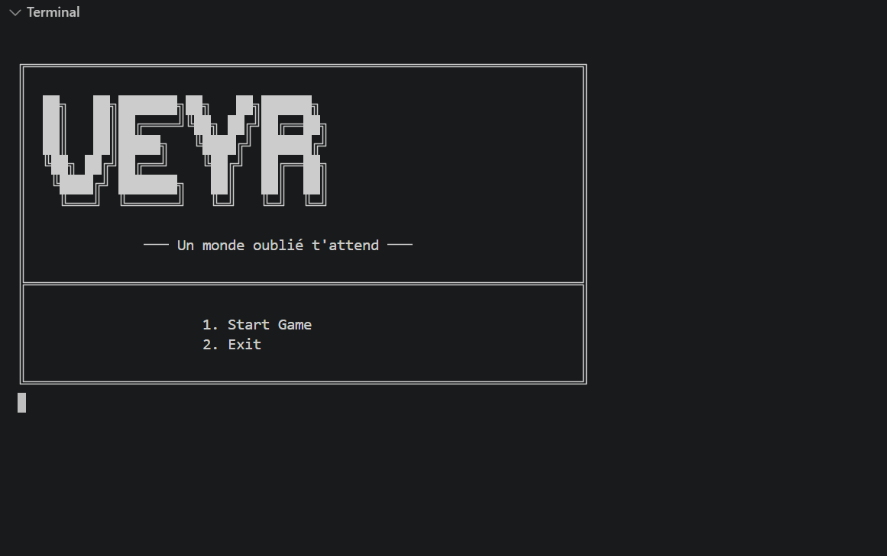
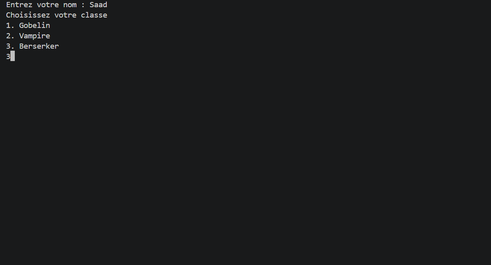
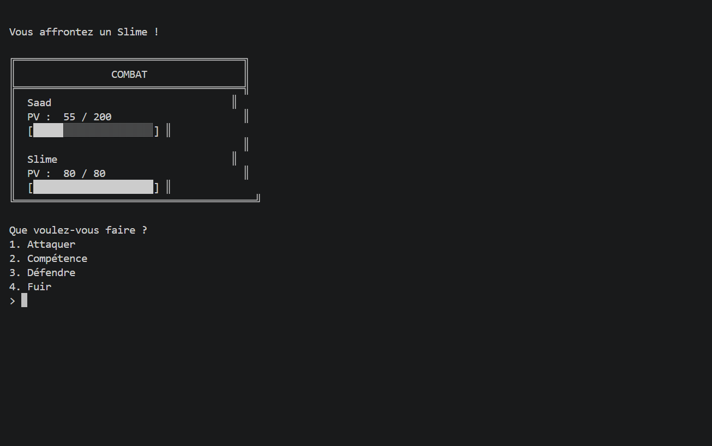
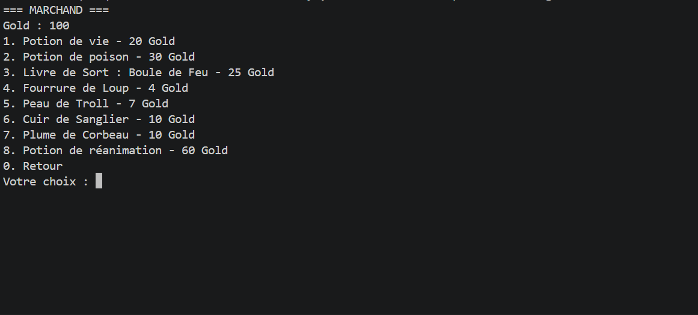

# Projet-red-3
# Veyr

> **Descendez dans les profondeurs de Veyr, affrontez ses créatures et découvrez ce qui se cache au fond du gouffre.**

---

## 1. Le Titre et l'Accroche

### Veyr — The Abyss Awaits

Veyr est un jeu de rôle **tour par tour en terminal**, développé en **Go**.

Le joueur doit choisir son personnage, explorer les profondeurs de Veyr, affronter des monstres et améliorer progressivement son personnage.

Chaque classe possède une mécanique de gameplay différente afin de rendre les combats plus variés.

---

## 2. Aperçu (Screenshots)

### Écran d'accueil

> 

### Création du personnage

> 

### Combat

> 

### Marchand

> 

---

## 3.Gestion du projet

Le suivi des tâches, des fonctionnalités et de l'avancement du projet est réalisé avec Trello.

([Voir le Trello du projet](https://trello.com/b/eK0VV6zm))
## 4. Fonctionnalités (Features)

### Système de personnage

* Création d'un personnage
* Choix du nom
* Choix de la classe
* Système de niveaux
* Points de vie et de mana
* Attaque, défense et initiative
* Gold
* Inventaire limité

### Classes

Trois classes sont actuellement disponibles :

**Gobelin**

* Classe basée sur la chance
* Possède une compétence unique reposant sur le hasard

**Vampire**

* Classe basée sur le vol de vie
* Peut infliger des dégâts à l'ennemi et récupérer des PV

**Berserker**

* 

### Système de combat

* Combats au tour par tour
* Système d'initiative
* Attaque
* Compétences propres aux classes
* Défense
* Fuite
* Dégâts variables
* Affichage des PV du joueur et du monstre
* Barres de vie
* Victoire et défaite

### Combat d'entraînement

Un système de combat d'entraînement permet de tester les mécaniques de combat sans conséquences sur la progression.

* Aucun gain de Gold
* Aucun gain d'XP
* Les PV sont restaurés après le combat
* Retour au menu après le combat

### Système d'inventaire

Le joueur possède un inventaire avec une capacité maximale.

Les objets sont représentés grâce à une interface commune permettant de gérer différents types d'objets.

### Marchand

Le joueur peut acheter différents objets avec son Gold :

* Potions
* Livres de sorts
* Matériaux
* Objets provenant des créatures

### Marchand


### Interface terminal

Le jeu utilise une interface entièrement basée sur le terminal avec :

* Menus
* Texte progressif
* ASCII art
* Barres de vie
* Couleurs ANSI
* Interface adaptée au jeu en terminal

---

## 4. Installation et Prérequis

### Prérequis

Pour lancer Veyr, il faut avoir installé :

* **Go 1.27.1 ou supérieur**
* Un terminal compatible avec les caractères Unicode et les couleurs ANSI
* Git pour récupérer le projet

### Installation

Cloner le repository :

```bash
git clone <URL_DU_REPOSITORY>
```

Entrer dans le dossier :

```bash
cd Projet-red-3
```

Initialiser/récupérer les dépendances :

```bash
go mod tidy
```

Lancer le jeu :

```bash
go run .
```

---

## 5. Utilisation (Usage)

Après avoir lancé le programme, le joueur arrive sur le menu principal.

Il peut commencer une partie et créer son personnage.

### Création du personnage

Le joueur doit :

1. Entrer son nom
2. Choisir une classe
3. Commencer son aventure

### Combat

Pendant un combat, plusieurs actions sont disponibles :

```text
1. Attaquer
2. Compétence
3. Défendre
4. Fuir
```

L'ordre des tours est déterminé grâce à l'initiative du joueur et du monstre.

### Entraînement

Le joueur peut également participer à un combat d'entraînement afin de tester son personnage sans perdre sa progression.

---

## 6. Configuration (Variables d'environnement)

Aucune variable d'environnement n'est nécessaire pour lancer le jeu.

La configuration du jeu est directement définie dans le code.

---

## 7. Structure du Projet (Arborescence)

```text
Projet-red-3/
│
├── main.go
│
├── game/
│   └── ...
│
├── characters/
│   ├── character.go
│   ├── gobelin.go
│   └── vampire.go
│
├── combat/
│   ├── combat.go
│   ├── trainingfight.go
│   └── skills.go
│
├── enemy/
│   ├── enemy.go
│   └── slime.go
│
├── item/
│   ├── item.go
│   ├── items.go
│   ├── potion.go
│   ├── material.go
│   └── spellbook.go
│
├── npc/
│   └── merchant.go
│
├── save/
│   └── ...
│
└── ui/
    ├── showinfo/
    └── text/
```

### Organisation des packages

* `game/` : gestion du déroulement général du jeu
* `characters/` : personnages et classes
* `combat/` : système de combat et compétences
* `enemy/` : monstres et leurs caractéristiques
* `item/` : objets, potions, matériaux et livres de sorts
* `npc/` : personnages non-joueurs et marchand
* `save/` : système de sauvegarde
* `ui/` : affichage et interface utilisateur

---

## 8. Licence et versions utilisées

### Langage

* **Go 1.27.1**

### Gestion du projet

* Git 2.53.0
* GitHub

### Licence

Projet réalisé dans le cadre du Projet Red à Ynov Campus Val d'europe.

---

## 9. Conclusion

**Veyr** est un RPG en terminal développé en Go ayant pour objectif de proposer une expérience de jeu simple mais complète directement depuis la ligne de commande.

Le projet met en œuvre plusieurs notions de programmation :

* Structures et méthodes Go
* Interfaces
* Packages
* Pointeurs
* Gestion des entrées utilisateur
* Système de combat
* Gestion d'inventaire
* Gestion des objets
* Organisation d'un projet en équipe avec Git

Le système est conçu pour pouvoir évoluer facilement avec l'ajout de nouvelles classes, monstres, objets, compétences et mécaniques de gameplay.

> **The abyss awaits.**
